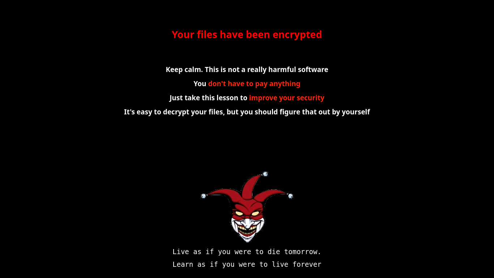

 
# Fsociety Ransomware

This is a small piece of software intended to be a PoC (Proof of Concept) of a ransomware with similar GUI to the one seen in Mr. Robot.

I disclaim all responsibility for the use of this software.

You should not use this to harm anyone. Precisely to avoid that, it is not very sophisticated to encrypt your data (no database or C&C server or asymmetric encryption are used).

However, this program have some measures to avoid being stopped. For example:

- Once the main window is opened, it difficult to close it (just as in Mr. Robot).
- Even if you get to close the main window, that won't stop the ransomware.
- If you restart your computer the ransomware will run automatically (only works on systemd computers).

I thought at first it'd be a good idea to write it as a mix of Java (for GUI) and C (for actual ransomware) code, but I abandoned that idea. Still, it is possible to do that, if you want to try fork this repo or open a PR.

Again, I discourage anyone to use this software against others, but if you want to run it in your personal computer that's ok, try to reverse-engineer or stop it, and let me know how I can improve it (not willing to add enhancements to encryption algorithm, or connect it to a C&C or database)